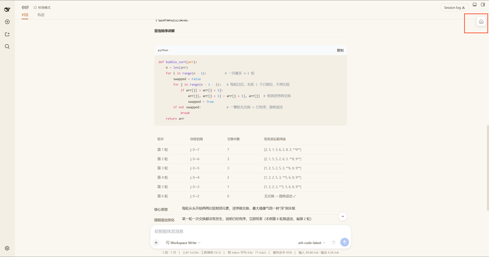
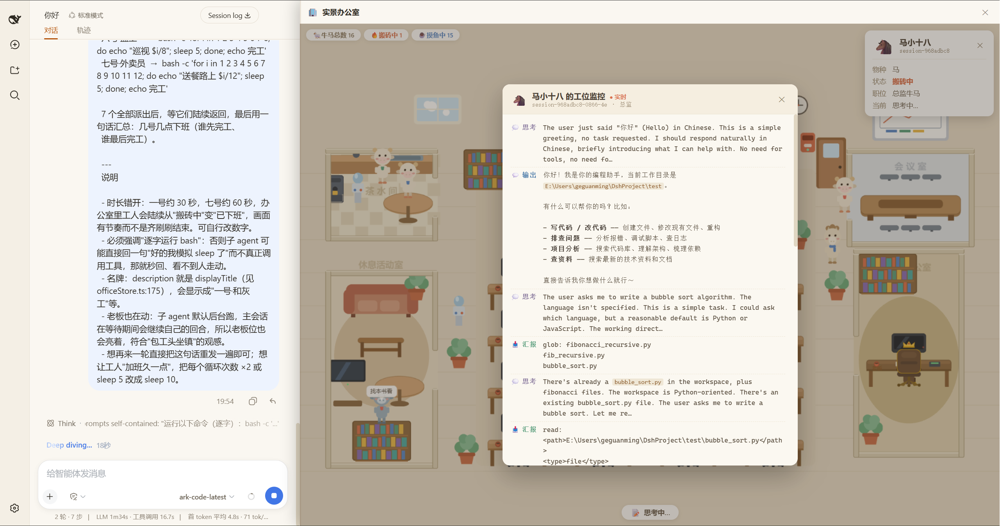
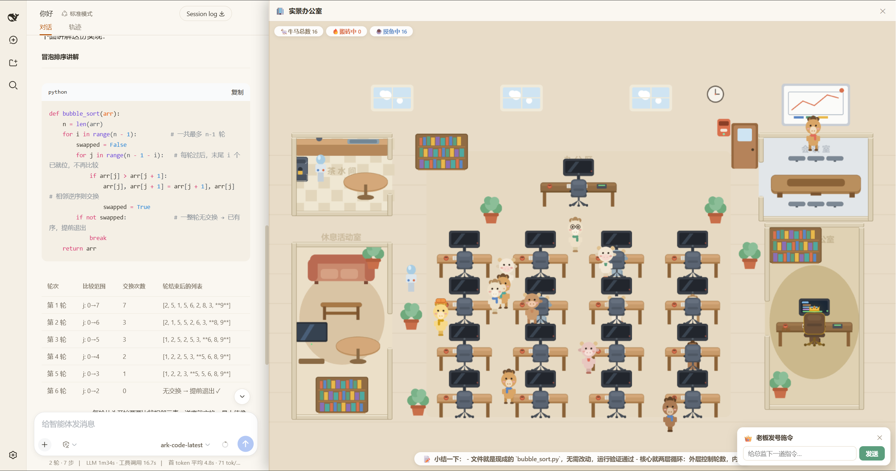

# DSH 牛马办公室

[](https://www.npmjs.com/package/dsh-office-plugin)
[](./LICENSE)

[English](./README.md) | 简体中文

DSH 牛马办公室是 [DeepSeek Harness（dsh）](https://github.com/deepseek-harness)的 Web UI 插件：把多智能体会话的实时活动渲染成一个像素风格的实景办公室。你的每一个 agent 会话都是一头戴工牌的牛马员工--搬砖的敲键盘、摸鱼的溜达打盹，而你，是坐在右下角老板办公室里、头戴皇冠的老板。

> 🌟 **如果这个项目让你会心一笑或帮到了你，请点一个 Star 支持一下，谢谢！**



## 角色设定

| 角色 | 是谁 | 在哪 | 长什么样 |
|---|---|---|---|
| **老板** | 你（用户）本人 | 右下角独立老板办公室 | 深棕正装 + 金饰 + 眼镜 + 金色皇冠 |
| **总监** | 当前会话（你正在对话的那个 agent） | 办公区上方总监位 | 金色系毛色 + 橙色工头帽 |
| **打工牛马** | 其余所有会话（含子 agent） | 办公区 4×4 工位 | 牛/马两种物种，按会话 id 稳定随机决定毛色与配饰 |

办公室最多容纳 16 头牛马（含总监位），超出的搬砖会话显示为「排队中」，前面的员工完成后自动补位。

## 功能一览

### 实时办公动态

- **搬砖中 / 摸鱼中**：会话运行时员工坐工位敲键盘，屏幕滚动代码、泛蓝光；空闲时坐下闲着，闲久了会趴桌睡觉（头顶飘 Zzz）。
- **头顶气泡**：流式输出、正在执行的工具、最新汇报，都以短气泡实时冒出。总监接到你的新指令时喊话「老板发话了，都给我干起来！」，并把在外面溜达的牛马全部叫回工位。
- **摸鱼漫游**：空闲员工会起身去茶水间接咖啡、会议室看白板、休息室瘫沙发，到了还会冒一句「接杯咖啡」「沙发边瘫一会儿」。
- **顶部看板**：牛马总数 / 搬砖中 / 摸鱼中 / 排队中实时统计。

### 点击交互

- **点员工**：弹出信息卡--物种、状态、职位（总监牛马 / 打工牛马）、当前正在干什么。
- **点工作中员工的屏幕**：打开「工位监控」窗口，实时滚动该 agent 的工作流：💭思考、💬输出、🔧工具、📥汇报四类条目，支持行内 markdown（加粗 / 行内代码）。

  

- **点老板**：弹出迷你输入条「老板发号施令」，直接给当前会话（总监）下指令--与主对话输入框同一条通道。发送成功后输入条收起，总监立刻冒泡喊话；失败则以红字内联提示，草稿保留可重发。

  

### 等你拍板（审批）

任何会话有待审批的工具调用、待回答的问题或待评审的计划时：

- 对应员工头顶周期性冒「🙋等拍板…」提醒；
- 办公室自动弹出拍板卡：approval 类直接就地**批准 / 拒绝**；question / plan-review 类给「去处理」按钮跳转原生面板；
- 点 ✕ 稍后处理，该条待办消失前不再打扰，新待办会再次弹出。

### 老板办公室与老板日常

老板（你）有自己的独立办公室：大班台、显示器、金滚边高背老板椅、书柜、绿植和地毯。老板以办公为主，间歇摸鱼：

- 办公时打字、屏幕滚代码、金光呼吸；
- 定时趴桌摸鱼，冒「☕ 摸鱼中，勿扰」「让牛马先跑一会儿」等语录；
- 也会起身在办公室内活动--翻翻文件、看看报表、浇浇花、到门口听听动静--但**从不出房门**，牛马也不会进来打扰。

### 摄像机

- 拖拽平移、滚轮缩放（以光标为锚点）、双击复位到完整视野；
- 面板尺寸变化时自动适配。

## 安装

前置：已安装 dsh CLI 并使用 web profile（`dsh web`）。

```sh
# 从 npm 安装（推荐）
dsh plugin --profile web add dsh-office-plugin

# 从本地路径
dsh plugin --profile web add ./office-plugin

# 从 tarball
dsh plugin --profile web add ./dsh-office-plugin-0.1.0.tgz

# 从 git（需在 profile 的 pnpm-workspace.yaml 中 allowBuilds，见下方说明）
dsh plugin --profile web add github:geguanming/dsh-office-plugin
```

安装后重启 `dsh web`（插件图在启动时读取）。浏览器右上角出现「实景办公室」入口，点击展开右侧办公室面板，对话保持在中栏。

> 注意：只有 `dsh plugin --profile web add` 能完整激活双半插件；`--patch` + file:/// URL 只加载宿主半部，浏览器代码不会被发现。

> git 方式安装拉取的是源码，需要插件自带的 `prepare` 脚本现场构建；pnpm ≥10 会拦截安装期构建脚本，需在你的 profile 目录（`~/.dsh/profiles/web`）的 `pnpm-workspace.yaml` 中加：
>
> ```yaml
> allowBuilds:
>   dsh-office-plugin: true
> ```

## 使用指南

1. `dsh web` 启动并安装插件后，点浏览器右上角入口展开办公室；
2. 展开时会自动收起左侧会话栏以获得更大视野，关闭面板自动恢复；
3. 观察整体：顶部看板 + 各员工屏幕亮灭即可掌握全局；
4. 点员工头像看信息卡，点工作中的屏幕看工位监控；
5. 直接点老板下指令，或等拍板卡弹出后就地审批；
6. 双击画布随时回到全景。

## 开发

```sh
pnpm install
pnpm run build       # tsdown 双配置：宿主半部 -> lib/index.js，浏览器半部 -> lib/client.js
pnpm run watch
pnpm run typecheck
```

本插件是 dsh「双半插件」：

- **宿主半部**（`src/index.ts`）：仅让插件出现在宿主 cordis 加载表里；
- **浏览器半部**（`src/client/`）：经 `package.json` 的 `dsh.client` 声明被发现，由加载器 serve 单文件 `/plugins/<id>/client.js`。

两条硬约束（改动前必读 [CLAUDE.md](./CLAUDE.md)）：

- `client.js` 必须是带 `window.__ModuleLoader__.load` banner 的单文件 CJS（`inlineDynamicImports: true`，pixi.js 的动态 import 会拆 chunk 导致 404）；
- `tsdown.config.ts` 的 external 列表须跟随 dsh 主仓库 `packages/client/web/src/platform.ts` 的 `PLATFORM_MODULES` 同步；`src/client/runtimeTypes.ts` 是与 `@deepseek-ai/dsh-client-runtime` 契约手动对齐的本地类型面。

## 致谢

- [pixi.js](https://pixijs.com/)（MIT）-- WebGL 渲染
- 灵感来自所有在办公室里认真搬砖的 agent 们
